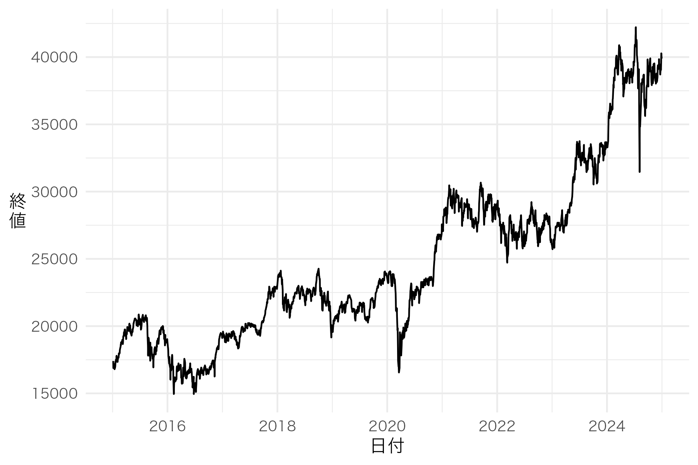
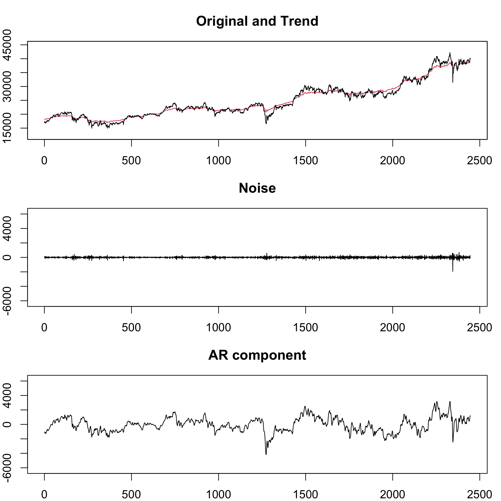
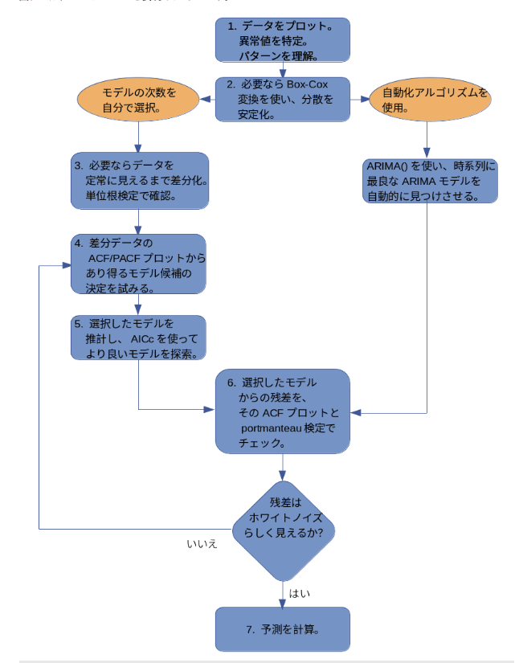
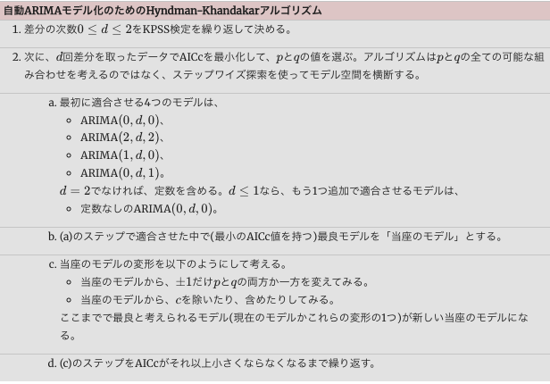
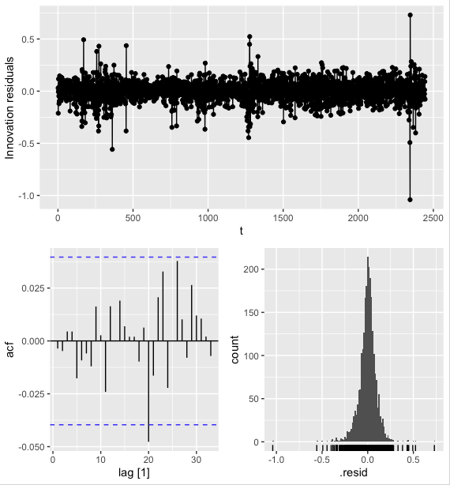

#取得データ<br>
```R
library(quantmod)
nikkei <- getSymbols(Symbols = "^N225", 
                     src = "yahoo",
                     from = "2015-01-01",
                     to = "2024-12-31",
                     auto.assign = FALSE)
nikkei_cl <- Cl(nikkei)
nikkei_cl <- na.omit(nikkei_cl)
```
#時系列プロット<br>
```r
df_nikkei <- ggplot2::fortify(nikkei_cl)
colnames(df_nikkei) <- c("Date", "Price")
p <- ggplot(data = df_nikkei, aes(x = Date, y = Price)) +
  geom_line() +
  theme_minimal(base_family = "HiraginoSans-W3") + 
  labs(title = NULL,
       x = "日付",
       # ▼▼▼ 修正点1: 文字の間に「\n」を入れて改行させる ▼▼▼
       y = "終\n値") +
  theme(
    # ▼▼▼ 修正点2: ラベルの角度を0度(水平)に戻す ▼▼▼
    axis.title.y = element_text(angle = 0, vjust = 0.5) 
  )
  print(p)
```
  

  2015 8/14〜 down  →　中国・上海株をはじめとした海外株安
https://www.nikkei.com/article/DGXLAS3LTSEC1_R20C15A8000000/

2015 8/29〜 up →買い戻し
https://jp.reuters.com/article/world/3530-idUSKCN0RU0FY/

2015 11/30〜 down → 日銀の金融緩和措置に対する失望
https://www.smd-am.co.jp/market/daily/marketreport/archives/japan/1251354_1951/#:~:text=18%E6%97%A5%E3%81%AE%E6%97%A5%E7%B5%8C%E5%B9%B3%E5%9D%87,%E5%AE%89%E3%81%8418%2C986.80%E5%86%86%E3%81%A7%E3%81%97%E3%81%9F%E3%80%82

2016 11/9〜 down → トランプ優勢による先行不安による下落　その後反動で急騰
https://www.nikkei.com/article/DGXLAS3LTSEC1_Z01C16A1000000/

2017 9/8〜 up → 衆院選解散総選挙
https://www.smd-am.co.jp/market/takumori/trend/2017/mijika170904/

2018 1/25〜 down →米長期金利上昇,変動性拡大（VIX上昇）,世界株安波及
https://www.nikkei.com/article/DGXLASS0ISS16_U8A100C1000000/

2018 9/10〜 up → 円の下落による海外投資家の日本株買い
https://www.nikkei.com/article/DGXLASFL28HCS_Y8A920C1000000/

2018 10/4〜 down → 米国株急落を背景とした海外投資家の売り行動
https://www.nikkei.com/article/DGXMZO37176320R31C18A0EN2000/

2018 12/3〜 down → 米連邦準備理事会(FRB)の利上げ決定により再度米国株急落
https://www.nikkei.com/article/DGXMZO39511740Y8A221C1000000/

2019 /9/2〜 up → FRB利下げ実施
https://www.nikkei.com/article/DGXMZO50393880Q9A930C1EN2000/
https://www.nikkei.com/article/DGXMZO53992110Q9A231C1000000/

2020 2/ 14〜 down → コロナショック
https://www.nikkei.com/article/DGXLAS3LTSEC1_V20C20A2000000/
https://www.nikkei.com/article/DGXMZO57807450Y0A400C2I00000/

2020 3/19〜 up → 米国の大規模な経済対策を巡る楽観,緊急事態宣言
https://www.nikkei.com/article/DGXMZO57195250V20C20A3000000/
https://www.nikkei.com/article/DGKKZO58659620Q0A430C2EN2000/
https://www.nikkei.com/article/DGXMZO59819810R00C20A6000000/

2020 11/2〜 up → コロナ反発
https://www.nikkei.com/article/DGXZQOMH0770H0X01C20A2000000/


2023/ 5/8〜 up → 海外投資家の買い行動
https://www.nikkei.com/article/DGXZQOUB184R90Y3A510C2000000/　
https://www.nikkei.com/article/DGXZQOUB00002_V00C23A6000000/

2024 1/5〜  up →NVIDIAの好決算による日本の半導体関連株買い
https://www.nikkei.com/article/DGXZQOFL220S70S4A220C2000000/

2024 7/11 → 最高値4万2224円
https://www.nikkei.com/article/DGXZQOUB237ML0T21C24A2000000/

2024 7/11〜 down → 米国景気後退の警戒感による売り　歴代2番目の下落率
https://www.nikkei.com/article/DGXZQOUB0556M0V00C24A8000000/

#decomp

デフォルト<br>decomp(y, trend.order = 2, ar.order = 2, seasonal.order = 1, 
         period = 1, log = FALSE, trade = FALSE, diff = 1,
         miss = 0, omax = 99999.9, plot = TRUE, ...)

引数<br>
y … tspの有無を問わない 単一変量の時系列。tspとはtsオブジェクトに含まれる
       start, end,frequencyの情報。今回使用したデータのxtsオブジェクトには含まれない。tspが含まれない場合、periodの引数がデフォルトでは1が使用される。

trend.order … トレンド成分の次数（1, 2, または 3）<br>
ar.order … AR成分の次数。10 以下で指定（まず 2 を試すことが推奨）<br>
seasonal.order … 季節成分の次数（0, 1, または 2）<br>
period … 1期間に含まれる季節の数。tspがあればfrequencyが利用される。今回は1で固定<br>
log … TRUEならば対数変換を行う<br>
trade … TRUE の場合、曜日効果を含むモデルを用いる。今回は使用しない。<br>
diff … 差分1か2を選択できる。<br>
miss … 欠測値の指定 今回は欠測値はないのでmiss＝０良い<br>
omax … 欠測値の指定に関わる引数だが今回は関係ない<br>
plot … TRUE固定　<br>

基本モデル<br>
$y(t) = T(t) + AR(t) + S(t) + TD(t) + W(t)$<br>
$T(t)$ … トレンド成分<br>
$AR(t)$ … AR過程<br>
$S(t)$ … 季節成分<br>
$TD(t)$ … 曜日効果成分<br>
$W(t)$ …観測ノイズ<br>

トレンド成分(m1はトレンド成分の次数)<br>
$m1 = 1: T(t) = T(t-1) + v_1(t)$<br>
$m1 = 2: T(t) = 2T(t-1) - T(t-2) + v_1(t)$<br>
$m1 = 3: T(t) = 3T(t-1) - 3T(t-2) + T(t-2) + v_1(t)$

AR成分(m2はAR成分の次数)<br>
季節成分 (kは季節成分の次数, fは周期)<br>
曜日効果成分<br>
$TD(t) = b(1)TRADE(t,1) + \dots + b(7)TRADE(t,7)$
where$TRADE(t,i)$ is the number of $i$-th days of &t&-th data and 
$b(1) +\dots+ b(7) = 0$<br>

値<br>
trend トレンド成分            
seasonal 季節成分              
ar    AR過程         
trad  曜日要因              
noise 観測ノイズ             
aic   AIC               
lkhd  尤度                
sigma2    σ²                
tau1  システムノイズ v1 の分散    
tau2  システムノイズ v2 または v3 の分散 
tau3  システムノイズ v3 の分散    
arcoef    AR係数ベクトル          
tdf   曜日要因（日〜土の順）       
conv.y    対数変換後のデータに NA が補われたもの 


decomp()実行<br>
trend.order = 1,2,3 ar.order = 1~7 seasonal.order = 0に設定し、モデル選択のためにAIC (Akaike Information Criterion)を比較する。ar.orderは8以降は処理が重すぎるかつ意味があまりないため除外。seasonal.orderは0,1,2はどれを選んでも、今回のデータがxtsオブジェクトのためfrequencyを持たず、自動的にfrequency = 1に設定されるため季節成分が無効化され全て同じモデル式になり、AICは全て同じ値になる。(検証済み)

AIC = -2(最大対数尤度) + 2(パラメータ数)

trend.order = 1 ar.order = 1 seasonal.order = 0 AIC = 35465.07 
trend.order = 1 ar.order = 2 seasonal.order = 0 AIC = 35370.69 
trend.order = 1 ar.order = 3 seasonal.order = 0 AIC = 35369.54 
trend.order = 1 ar.order = 4 seasonal.order = 0 AIC = 35368.89 
trend.order = 1 ar.order = 5 seasonal.order = 0 AIC = 35631.88 
trend.order = 1 ar.order = 6 seasonal.order = 0 AIC = 35354.22 
trend.order = 1 ar.order = 7 seasonal.order = 0 AIC = 35388.21 
trend.order = 2 ar.order = 1 seasonal.order = 0 AIC = 35644.09 
trend.order = 2 ar.order = 2 seasonal.order = 0 AIC = 35411.51 
trend.order = 2 ar.order = 3 seasonal.order = 0 AIC = 35402.68 
trend.order = 2 ar.order = 4 seasonal.order = 0 AIC = 35389.37 
trend.order = 2 ar.order = 5 seasonal.order = 0 AIC = 35393.69 
trend.order = 2 ar.order = 6 seasonal.order = 0 AIC = 35390.23 
trend.order = 2 ar.order = 7 seasonal.order = 0 AIC = 35391.92 
trend.order = 3 ar.order = 1 seasonal.order = 0 AIC = 35832.37 
trend.order = 3 ar.order = 2 seasonal.order = 0 AIC = 35560.81 
trend.order = 3 ar.order = 3 seasonal.order = 0 AIC = 35550.06 
trend.order = 3 ar.order = 4 seasonal.order = 0 AIC = 35530.52 
trend.order = 3 ar.order = 5 seasonal.order = 0 AIC = 35534.47 
trend.order = 3 ar.order = 6 seasonal.order = 0 AIC = 35527.38 
trend.order = 3 ar.order = 7 seasonal.order = 0 AIC = 35530.68 

AIC最小はtrend.order=1,ar.order=6,seasonal.order=0,AIC=35354.22
このモデルで実行する

decomp(nikkei_cl, trend.order = 1, ar.order = 6, seasonal.order = 0)



#ARIMA
モデル化の手順
(非季節性)時系列データにARIMAモデルを適合させる際は、以下の手順が有益な一般的アプローチを提供してくれます。

1.データをプロットして、異常値を特定する。
2.必要なら、(Box-Cox変換を使って)データを変換し、分散を安定化させる。
3.データが非定常なら、定常になるまでデータの一つ目差分を取る。
4.ACF/PACFを検討する: ARIMA( p,d,0)モデルとARIMA( 0,d,q)モデルのどちらが適切か？
5.選んだモデルを試す、そして、AICcを使ってより良いモデルを探索する。
6.選んだモデルからの残差を、ACFプロットやportmanteau検定でチェックする。
   残差がホ   ワイトノイズらしくなければ、モデルを修正して試す。
7.残差がホワイトノイズらしく見えるようになったら、予測を計算する。


参照)https://otexts.com/fppjp/arima-r.html

データの前処理<br>
fableパッケージのARIMA()はxtsを受け付けないので、tsibbleに変換する必要がある。また、tsibbleに変換する際に、今回のデータのような等間隔ではないデータでARIMA()を行うと、モデルがNULLになり実行できない。そのため、列にindexふり、indexを明示する列を作って対処する。

```r
> nikkei_ts <- tibble(
+   date  = as.Date(time(nikkei_cl)),       
+   close = as.numeric(nikkei_cl)         
+ ) |> 
+   as_tsibble(index = date)
> 

nikkei_ts_idx <- nikkei_ts |>
  mutate(t = row_number()) |>
  as_tsibble(index = t)
```

Box-Cox変換
必要ならbox-cox変換を行う必要があるため、変換したデータとしていないデータでモデルを作成し、AICを比較する。

Box-Cox変換　https://en.wikipedia.org/wiki/Power_transform <br>
$$
y_i^{(\lambda)} = 
\begin{cases} 
  \dfrac{y_i^\lambda - 1}{\lambda} & \text{if } \lambda \neq 0 \\
  \ln(y_i) & \text{if } \lambda = 0 
\end{cases}
$$

時系列データに対してBox-Cox変換を行う理論的根拠について調べる
逆変換をしたときに戻るのか　変換にはリスクがある
時系列の分散とは？

変換処理<br>
```r
> lambda <- BoxCox.lambda(nikkei_ts$close)
> lambda
[1] 0.1973842
> nikkei_ts_idx <- nikkei_ts_idx |>
+   mutate(close_bc = box_cox(close, lambda))

> nikkei_ts_idx
# A tsibble: 2,445 x 4 [1]
   date        close     t close_bc
   <date>      <dbl> <int>    <dbl>
 1 2015-01-05 17409.     1     29.7
 2 2015-01-06 16883.     2     29.5
 3 2015-01-07 16885.     3     29.5
 4 2015-01-08 17167.     4     29.7
 5 2015-01-09 17198.     5     29.7
 6 2015-01-13 17088.     6     29.6
 7 2015-01-14 16796.     7     29.5
 8 2015-01-15 17109.     8     29.6
 9 2015-01-16 16864.     9     29.5
10 2015-01-19 17014.    10     29.6

```

モデル作成
```
> model <- nikkei_ts_idx |>
+   model(auto = ARIMA(close))
> 
> 
> model_bc <- nikkei_ts_idx |>
+   model(auto = ARIMA(close_bc))

> report(model)
Series: close 
Model: ARIMA(2,1,1) w/ drift 

Coefficients:
          ar1     ar2     ma1  constant
      -0.7151  0.0121  0.6841   15.5509
s.e.   0.1616  0.0236  0.1605   11.1745

sigma^2 estimated as 107779:  log likelihood=-17626.22
AIC=35262.44   AICc=35262.47   BIC=35291.45


> report(model_bc)
Series: close_bc 
Model: ARIMA(3,1,3) w/ drift 

Coefficients:
          ar1     ar2     ar3     ma1      ma2      ma3  constant
      -0.0766  0.6853  0.3228  0.0507  -0.6621  -0.3466     2e-04
s.e.      NaN  0.1474     NaN     NaN   0.1551      NaN     1e-04

sigma^2 estimated as 0.009011:  log likelihood=2290.4
AIC=-4564.8   AICc=-4564.74   BIC=-4518.39

```

AICcが小さいBox-Cox変換を行ったデータを使ったARIMA(3,1,3)を採用

残差のACFプロット

概ね自己相関は信頼区間内にあり、残差の動きはホワイトノイズと呼べそう

https://en.wikipedia.org/wiki/Portmanteau_test <br>
portmanteau検定を実行する
```r
> model_bc |>
+   augment() |>
+   filter(.model == "auto") |>
+   features(.innov, ljung_box, lag = 10, dof = 3)
# A tibble: 1 × 3
  .model lb_stat lb_pvalue
  <chr>    <dbl>     <dbl>
1 auto      2.27     0.943
```

p値が0.943であるため、残差はホワイトノイズであると示唆している。
予測

```r
> model_bc |>
+   forecast(h = 250) |>
+   filter(.model == "auto") |>
+   autoplot(nikkei_ts_idx) +
+   labs(
+     title = "One-year Forecast of Nikkei 225",
+     y = "Nikkei 225 (level scale)",
+     level = "Prediction interval"
+   )
```